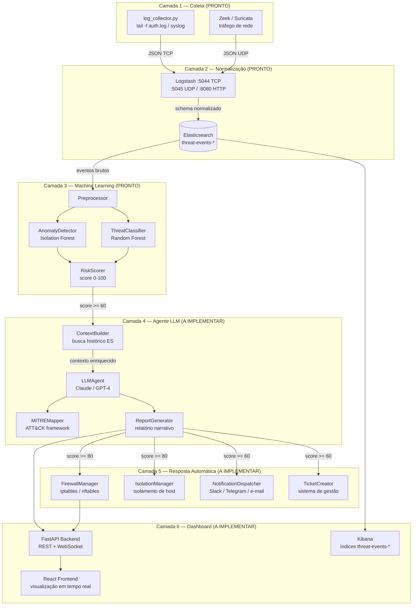
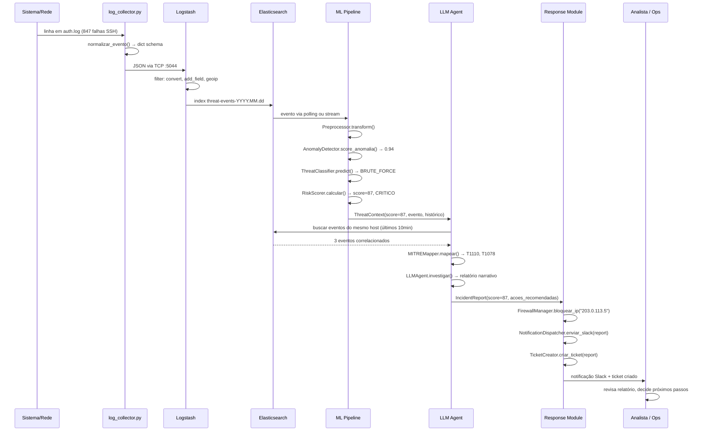
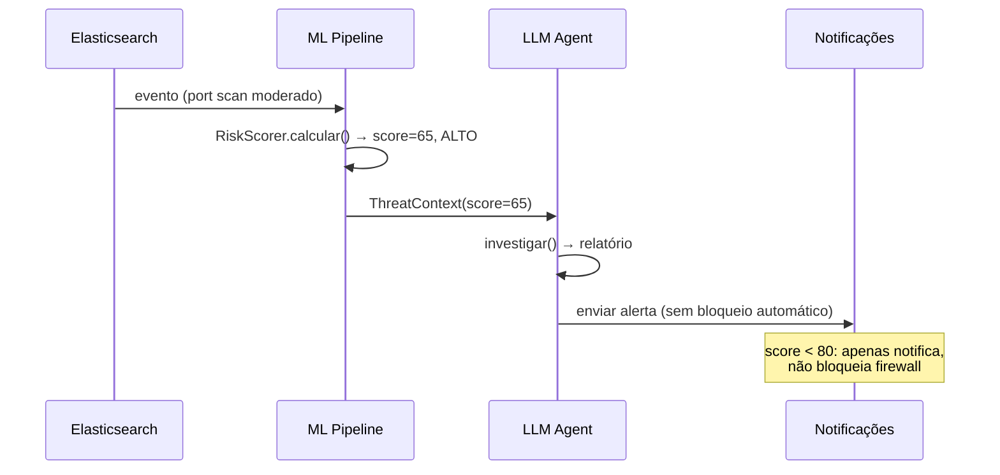

# Design Document: AI-Powered Threat Hunter — Roadmap de Implementação

## Overview

O AI-Powered Threat Hunter é um sistema de segurança defensiva autônomo estruturado em 6 camadas encadeadas. As camadas 1 (Coleta), 2 (Normalização) e 3 (ML) estão implementadas e testadas. Este documento especifica a arquitetura completa do sistema, com foco especial nas camadas 4 (Agente LLM), 5 (Resposta Automática) e 6 (Dashboard), que ainda precisam ser construídas.

O objetivo é fornecer contratos de interface claros entre cada camada, critérios objetivos de "pronto" para cada entrega, e propriedades de corretude verificáveis via property-based testing — permitindo que cada camada seja desenvolvida, testada e integrada de forma independente e documentada.

## Architecture



## Sequence Diagrams

### Fluxo Principal — Detecção e Resposta a Incidente Crítico



### Fluxo de Score Médio — Investigação sem Resposta Automática



## Components and Interfaces

### Camada 1 - Coleta (collector/syslog/log_collector.py) - PRONTO

**Status**: Implementado e testado.

**Interface publica**:

```python
def normalizar_evento(linha: str, arquivo: str) -> dict | None:
    # Retorna evento no schema padrao ou None se linha nao reconhecida.
    # Garante: se retorna dict, contem todos os campos obrigatorios do schema.

def conectar_logstash() -> socket.socket:
    # Retorna socket TCP conectado. Retry com backoff exponencial (max 60s).
    # Garante: nunca retorna socket desconectado.

def enviar_evento(sock: socket.socket, evento: dict) -> None:
    # Serializa evento como JSON + newline e envia via TCP.
    # Protocolo: json_lines (compativel com Logstash codec json_lines).
```

**Schema de saida obrigatorio**:

```python
{
    "timestamp":  str,   # ISO 8601 UTC
    "event_type": str,   # auth_failure | auth_success | privilege_escalation | session_closed
    "source":     str,   # caminho do arquivo de origem
    "raw_log":    str,   # linha bruta original
    "severity":   None,  # preenchido pelo Logstash/ML
    "ml_score":   -1,    # -1 = nao processado
    # campos opcionais por event_type:
    "username":   str,   # auth_failure, auth_success, privilege_escalation, session_closed
    "source_ip":  str,   # auth_failure, auth_success
    "command":    str,   # privilege_escalation
}
```

**Criterio de pronto**:
- [ ] normalizar_evento() retorna None para linhas nao reconhecidas
- [ ] Todos os campos obrigatorios presentes no dict retornado
- [ ] Reconexao automatica ao Logstash em caso de BrokenPipeError
- [ ] Testes unitarios passando: tests/collector/test_log_collector.py

---

### Camada 2 - Normalizacao (docker/logstash/) - PRONTO

**Status**: Implementado via Docker ELK Stack.

**Contrato de entrada** (qualquer formato aceito):
- TCP :5044 - json_lines (coletor Python)
- UDP :5045 - json_lines (Zeek/Suricata)
- HTTP :8080 - JSON body (testes/integracoes)

**Schema de saida no Elasticsearch** (indice threat-events-YYYY.MM.dd):

```python
{
    "@timestamp":     str,    # ISO 8601 UTC (parseado pelo Logstash)
    "event_type":     str,    # tipo do evento
    "source_ip":      str,    # IP de origem (quando disponivel)
    "category":       str,    # authentication | network | application
    "count":          int,    # contagem de eventos
    "bytes_sent":     int,    # bytes enviados
    "bytes_received": int,    # bytes recebidos
    "duration_ms":    float,  # duracao em ms
    "http_status":    int,    # codigo HTTP (0 se nao aplicavel)
    "severity":       str,    # unknown | high | medium (hint do Logstash)
    "ml_score":       int,    # -1 (nao processado)
    "agent_analyzed": bool,   # false (nao analisado pelo LLM)
    "geo":            dict,   # geolocalizacao do source_ip (quando disponivel)
    # tags automaticas:
    # brute_force_candidate       -> count > 100 em auth_failure
    # data_exfiltration_candidate -> bytes_sent > 10MB
    # sql_injection_candidate     -> payload com padrao SQL
}
```

**Criterio de pronto**:
- [ ] ELK Stack sobe sem erros via docker compose
- [ ] Evento enviado via TCP aparece no Elasticsearch em < 5s
- [ ] Kibana acessivel em http://localhost:5601
- [ ] Indice threat-events-* criado automaticamente

---

### Camada 3 - Machine Learning (ml/) - PRONTO

**Status**: Implementado e testado.

**Interface publica do pipeline**:

```python
class Preprocessor:
    def fit(self, eventos: list[dict]) -> Preprocessor: ...
    def transform(self, eventos: list[dict]) -> np.ndarray: ...
    def fit_transform(self, eventos: list[dict]) -> np.ndarray: ...

class AnomalyDetector:
    def fit(self, X: np.ndarray) -> AnomalyDetector: ...
    def score_anomalia(self, X: np.ndarray) -> np.ndarray: ...  # [0.0, 1.0]
    def is_anomalo(self, X: np.ndarray, threshold: float = 0.7) -> np.ndarray: ...
    def predict(self, X: np.ndarray) -> np.ndarray: ...  # 1=normal, -1=anomalo

class ThreatClassifier:
    def fit(self, X: np.ndarray, y: np.ndarray) -> ThreatClassifier: ...
    def predict(self, X: np.ndarray) -> list[str]: ...  # nomes das classes
    def predict_proba(self, X: np.ndarray) -> list[dict]: ...  # {classe: prob}
    def severidade_base(self, classe: str) -> int: ...  # 0-100

class RiskScorer:
    def calcular(self, evento: dict, X: np.ndarray) -> ResultadoScore: ...
    def calcular_lote(self, eventos: list[dict], X: np.ndarray) -> list[ResultadoScore]: ...

@dataclass
class ResultadoScore:
    score: float                      # 0-100
    severidade: str                   # INFO | BAIXO | MEDIO | ALTO | CRITICO
    score_anomalia: float             # 0.0-1.0
    is_anomalo: bool
    classe_ameaca: str                # NORMAL | BRUTE_FORCE | PORT_SCAN | ...
    probabilidades: dict              # {classe: probabilidade}
    requer_resposta_automatica: bool  # score >= 80
    requer_investigacao_llm: bool     # score >= 60
```

**Thresholds de roteamento**:

```python
THRESHOLD_CRITICO = 80  # Resposta automatica imediata
THRESHOLD_ALTO    = 60  # Agente LLM investiga
THRESHOLD_MEDIO   = 40  # Alerta para revisao humana
THRESHOLD_BAIXO   = 20  # Log informativo
```

**Criterio de pronto**:
- [ ] Todos os testes em tests/ml/ passando
- [ ] trainer.py executa sem erros com dados sinteticos
- [ ] RiskScorer.calcular() retorna score em [0, 100] para qualquer entrada valida
- [ ] Artefatos salvos em ml/artifacts/ apos treinamento

---

### Camada 4 - Agente LLM (agent/) - A IMPLEMENTAR

**Responsabilidade**: Receber alertas com score >= 60, enriquecer com contexto historico do Elasticsearch, mapear no MITRE ATT&CK e gerar relatorio narrativo de incidente.

**Estrutura de arquivos proposta**:

```
agent/
├── __init__.py
├── llm_agent.py          # Orquestrador principal
├── context_builder.py    # Busca contexto no Elasticsearch
├── mitre_mapper.py       # Mapeamento para ATT&CK framework
├── report_generator.py   # Geracao do relatorio final
└── prompts/
    ├── investigation.txt  # Prompt de investigacao
    └── report.txt         # Prompt de geracao de relatorio
```

**Interface publica**:

```python
@dataclass
class ThreatContext:
    evento_id: str
    evento_atual: dict
    score: ResultadoScore
    eventos_correlacionados: list[dict]   # ultimos 10min do mesmo host
    historico_ip: list[dict]              # aparicoes anteriores do source_ip
    timestamp_inicio: str
    timestamp_fim: str

@dataclass
class IncidentReport:
    incident_id: str                      # formato: INC-YYYY-NNNN
    severidade: str
    resumo: str                           # 1-2 frases
    linha_do_tempo: list[dict]            # eventos ordenados por timestamp
    impacto_estimado: str
    acoes_recomendadas: list[str]
    tecnicas_mitre: list[str]             # ex: [T1110, T1078]
    confianca: float                      # 0.0-1.0
    timestamp_geracao: str
    raw_llm_response: str                 # resposta bruta do LLM

class ContextBuilder:
    def __init__(self, es_client: Elasticsearch): ...
    def construir(self, evento: dict, score: ResultadoScore) -> ThreatContext:
        # Busca no ES eventos do mesmo source_ip nos ultimos 10 minutos
        # e historico do source_ip nos ultimos 30 dias.
        # Garante: retorna ThreatContext mesmo se ES nao retornar resultados.

class MITREMapper:
    MAPEAMENTO = {
        "BRUTE_FORCE":          ["T1110"],
        "PORT_SCAN":            ["T1046"],
        "DDOS":                 ["T1498"],
        "LATERAL_MOVEMENT":     ["T1021"],
        "DATA_EXFILTRATION":    ["T1041"],
        "PRIVILEGE_ESCALATION": ["T1068"],
    }
    def mapear(self, classe_ameaca: str, contexto: ThreatContext) -> list[str]: ...

class LLMAgent:
    def __init__(self, api_key: str, model: str = "claude-3-5-sonnet-20241022"): ...
    def investigar(self, contexto: ThreatContext) -> IncidentReport:
        # Envia contexto ao LLM e retorna relatorio estruturado.
        # Garante: nunca lanca excecao - retorna relatorio com erro em caso de falha.
        # Timeout: 30s por chamada. Retry: 3 tentativas com backoff exponencial.
```

**Criterio de pronto**:
- [ ] LLMAgent.investigar() retorna IncidentReport valido para qualquer ThreatContext
- [ ] IncidentReport sempre contem incident_id, resumo, linha_do_tempo, tecnicas_mitre
- [ ] Falha na API do LLM nao propaga excecao (retorna relatorio com confianca=0.0)
- [ ] ContextBuilder retorna contexto em < 2s (timeout no ES)
- [ ] Testes unitarios com mock da API LLM passando
- [ ] Testes de integracao com Elasticsearch passando

---

### Camada 5 - Resposta Automatica (response/) - A IMPLEMENTAR

**Responsabilidade**: Executar acoes defensivas automaticas para incidentes com score >= 80, e notificacoes para score >= 60.

**Estrutura de arquivos proposta**:

```
response/
├── __init__.py
├── firewall.py           # Bloqueio de IPs via iptables/nftables
├── isolation.py          # Isolamento de hosts da rede
├── notifications.py      # Slack, Telegram, e-mail
├── ticket.py             # Criacao de tickets
└── orchestrator.py       # Orquestra todas as acoes
```

**Interface publica**:

```python
@dataclass
class ResponseAction:
    tipo: str           # firewall_block | host_isolation | notification | ticket
    alvo: str           # IP, hostname, canal, etc.
    status: str         # pending | success | failed
    timestamp: str
    detalhes: dict
    erro: str | None    # mensagem de erro se status == failed

class FirewallManager:
    def bloquear_ip(self, ip: str, duracao_segundos: int = 3600) -> ResponseAction:
        # Adiciona regra DROP para o IP via iptables/nftables.
        # Garante: idempotente - bloquear IP ja bloqueado nao gera erro.
        # Garante: registra regra em arquivo para persistencia apos reboot.
        # Requer: execucao com privilegios (sudo ou root).
    def desbloquear_ip(self, ip: str) -> ResponseAction: ...
    def listar_bloqueados(self) -> list[str]: ...

class IsolationManager:
    def isolar_host(self, hostname: str) -> ResponseAction:
        # Remove host da rede interna (drop all traffic exceto management).
        # Garante: host isolado ainda aceita conexoes de management (porta 22 do bastion).
        # Garante: isolamento e reversivel via desfazer_isolamento().
    def desfazer_isolamento(self, hostname: str) -> ResponseAction: ...

class NotificationDispatcher:
    def enviar_slack(self, report: IncidentReport, webhook_url: str) -> ResponseAction: ...
    def enviar_telegram(self, report: IncidentReport, bot_token: str, chat_id: str) -> ResponseAction: ...
    def enviar_email(self, report: IncidentReport, destinatarios: list[str]) -> ResponseAction: ...

class ResponseOrchestrator:
    def executar(self, report: IncidentReport) -> list[ResponseAction]:
        # score >= 80 (CRITICO): bloquear_ip + notificar + criar_ticket
        # score >= 60 (ALTO):    notificar + criar_ticket
        # Garante: falha em uma acao nao impede execucao das demais.
        # Garante: todas as acoes sao registradas independente do resultado.
```

**Criterio de pronto**:
- [ ] FirewallManager.bloquear_ip() e idempotente (chamadas repetidas nao geram erro)
- [ ] ResponseOrchestrator.executar() retorna lista de ResponseAction mesmo se todas falharem
- [ ] Notificacoes enviadas em < 5s apos chamada
- [ ] Testes unitarios com mock de iptables e APIs de notificacao passando
- [ ] Testes de integracao em ambiente Docker passando

---

### Camada 6 - Dashboard (dashboard/) - A IMPLEMENTAR

**Responsabilidade**: Interface visual para supervisao humana em tempo real dos incidentes, acoes automaticas e saude geral do sistema.

**Estrutura de arquivos proposta**:

```
dashboard/
├── backend/
│   ├── main.py           # FastAPI app
│   ├── routes/
│   │   ├── incidents.py  # GET /incidents, GET /incidents/{id}
│   │   ├── actions.py    # GET /actions, POST /actions/{id}/undo
│   │   └── health.py     # GET /health
│   └── websocket.py      # WebSocket para eventos em tempo real
└── frontend/
    ├── src/
    │   ├── components/
    │   │   ├── IncidentList.tsx
    │   │   ├── IncidentDetail.tsx
    │   │   ├── ThreatHeatmap.tsx
    │   │   └── SystemHealth.tsx
    │   └── App.tsx
    └── package.json
```

**Interface da API REST**:

```python
# GET /incidents?limit=50&severity=CRITICO&from=2026-01-01
# Response: { total: int, incidents: [{ incident_id, severidade, resumo, timestamp, tecnicas_mitre, acoes_executadas, status }] }

# GET /incidents/{incident_id}
# Response: IncidentReport completo + ResponseActions

# POST /incidents/{incident_id}/status
# Body: { status: resolved | false_positive }

# GET /health
# Response: { elasticsearch, logstash, ml_pipeline, llm_agent: up|down, score_saude: float }

# WebSocket /ws/events
# Emite: IncidentReport em tempo real quando score >= 60
```

**Criterio de pronto**:
- [ ] GET /incidents retorna lista paginada em < 500ms
- [ ] WebSocket emite evento em < 1s apos geracao do relatorio
- [ ] Dashboard exibe incidentes em tempo real sem refresh manual
- [ ] GET /health reflete estado real dos servicos
- [ ] Testes de API passando (pytest + httpx)

## Data Models

### Schema Padrao de Evento (contrato entre todas as camadas)

```python
# Evento bruto saindo do coletor (Camada 1 -> Camada 2)
EventoBruto = {
    "timestamp":  str,    # ISO 8601 UTC
    "event_type": str,    # auth_failure | auth_success | privilege_escalation | session_closed | network_connection | http_request
    "source":     str,    # arquivo de origem
    "raw_log":    str,    # linha bruta
    "severity":   None,
    "ml_score":   -1,
    # opcionais:
    "username":   str,
    "source_ip":  str,
    "command":    str,
}

# Evento normalizado no Elasticsearch (Camada 2 -> Camada 3)
EventoNormalizado = {
    "@timestamp":     str,
    "event_type":     str,
    "source_ip":      str,
    "category":       str,    # authentication | network | application
    "count":          int,
    "bytes_sent":     int,
    "bytes_received": int,
    "duration_ms":    float,
    "http_status":    int,
    "severity":       str,    # unknown | high | medium
    "ml_score":       int,    # -1
    "agent_analyzed": bool,   # False
    "geo":            dict,   # opcional
}

# Evento apos scoring ML (Camada 3 -> Camada 4)
EventoScorado = EventoNormalizado | {
    "ml_score":                    float,  # 0-100
    "ml_severidade":               str,    # INFO | BAIXO | MEDIO | ALTO | CRITICO
    "ml_classe_ameaca":            str,    # NORMAL | BRUTE_FORCE | ...
    "ml_score_anomalia":           float,  # 0.0-1.0
    "ml_probabilidades":           dict,   # {classe: prob}
    "requer_investigacao_llm":     bool,
    "requer_resposta_automatica":  bool,
}
```

### Mapeamento MITRE ATT&CK

```python
MITRE_MAPPING = {
    "BRUTE_FORCE": {
        "tecnicas": ["T1110"],
        "taticas":  ["TA0006"],  # Credential Access
        "descricao": "Tentativas repetidas de autenticacao para adivinhar credenciais",
    },
    "PORT_SCAN": {
        "tecnicas": ["T1046"],
        "taticas":  ["TA0007"],  # Discovery
        "descricao": "Varredura de portas para descobrir servicos ativos",
    },
    "DDOS": {
        "tecnicas": ["T1498"],
        "taticas":  ["TA0040"],  # Impact
        "descricao": "Ataque de negacao de servico por volume de trafego",
    },
    "LATERAL_MOVEMENT": {
        "tecnicas": ["T1021"],
        "taticas":  ["TA0008"],  # Lateral Movement
        "descricao": "Movimentacao entre sistemas internos usando credenciais validas",
    },
    "DATA_EXFILTRATION": {
        "tecnicas": ["T1041"],
        "taticas":  ["TA0010"],  # Exfiltration
        "descricao": "Transferencia de dados para destino externo nao autorizado",
    },
    "PRIVILEGE_ESCALATION": {
        "tecnicas": ["T1068"],
        "taticas":  ["TA0004"],  # Privilege Escalation
        "descricao": "Obtencao de permissoes acima do nivel autorizado",
    },
}
```

## Algorithmic Pseudocode

### Algoritmo Principal - Pipeline de Processamento de Evento

```pascal
ALGORITHM processar_evento(evento_bruto)
INPUT:  evento_bruto de tipo EventoBruto
OUTPUT: acoes_executadas de tipo list[ResponseAction]

PRECONDITIONS:
  - evento_bruto contem todos os campos obrigatorios do schema
  - Preprocessor, AnomalyDetector, ThreatClassifier estao treinados e carregados

POSTCONDITIONS:
  - Se score >= 60: IncidentReport gerado e persistido
  - Se score >= 80: acoes de resposta executadas
  - Evento atualizado no Elasticsearch com ml_score e ml_severidade

BEGIN
  // Camada 3: ML Pipeline
  X <- preprocessor.transform([evento_bruto])
  resultado <- risk_scorer.calcular(evento_bruto, X)

  // Atualiza evento no Elasticsearch
  elasticsearch.update(evento_bruto["_id"], {
    "ml_score":     resultado.score,
    "ml_severidade": resultado.severidade,
    "ml_classe_ameaca": resultado.classe_ameaca,
  })

  IF resultado.score < THRESHOLD_ALTO THEN
    RETURN []  // Apenas log, sem acao adicional
  END IF

  // Camada 4: Agente LLM (score >= 60)
  contexto <- context_builder.construir(evento_bruto, resultado)
  relatorio <- llm_agent.investigar(contexto)

  // Persiste relatorio
  elasticsearch.index("incidents", relatorio)

  IF resultado.score < THRESHOLD_CRITICO THEN
    // Apenas notifica, sem bloqueio automatico
    notificacoes <- notification_dispatcher.enviar_slack(relatorio)
    RETURN [notificacoes]
  END IF

  // Camada 5: Resposta Automatica (score >= 80)
  acoes <- response_orchestrator.executar(relatorio)

  RETURN acoes
END

LOOP INVARIANT (para processamento em lote):
  - Todos os eventos processados anteriormente tiveram ml_score atualizado no ES
  - Nenhuma acao de resposta foi executada para eventos com score < THRESHOLD_CRITICO
```

### Algoritmo de Construcao de Contexto (ContextBuilder)

```pascal
ALGORITHM construir_contexto(evento, score)
INPUT:  evento de tipo EventoNormalizado, score de tipo ResultadoScore
OUTPUT: contexto de tipo ThreatContext

PRECONDITIONS:
  - evento contem source_ip ou hostname
  - Elasticsearch acessivel (timeout: 2s)

POSTCONDITIONS:
  - contexto.eventos_correlacionados contem eventos do mesmo source_ip nos ultimos 10min
  - contexto.historico_ip contem aparicoes do source_ip nos ultimos 30 dias
  - Se ES indisponivel: retorna ThreatContext com listas vazias (nunca lanca excecao)

BEGIN
  source_ip <- evento.get("source_ip", "")
  agora <- datetime.utcnow()
  dez_minutos_atras <- agora - timedelta(minutes=10)
  trinta_dias_atras <- agora - timedelta(days=30)

  TRY
    // Busca eventos correlacionados (ultimos 10 minutos)
    correlacionados <- elasticsearch.search(
      index="threat-events-*",
      query={
        "bool": {
          "must": [
            {"term": {"source_ip": source_ip}},
            {"range": {"@timestamp": {"gte": dez_minutos_atras}}}
          ]
        }
      },
      size=50
    )

    // Busca historico do IP (ultimos 30 dias)
    historico <- elasticsearch.search(
      index="threat-events-*",
      query={
        "bool": {
          "must": [
            {"term": {"source_ip": source_ip}},
            {"range": {"@timestamp": {"gte": trinta_dias_atras}}}
          ]
        }
      },
      size=100
    )

  CATCH ElasticsearchException
    correlacionados <- []
    historico <- []
  END TRY

  RETURN ThreatContext(
    evento_id=evento["_id"],
    evento_atual=evento,
    score=score,
    eventos_correlacionados=correlacionados,
    historico_ip=historico,
    timestamp_inicio=dez_minutos_atras.isoformat(),
    timestamp_fim=agora.isoformat(),
  )
END
```

### Algoritmo de Resposta Automatica (ResponseOrchestrator)

```pascal
ALGORITHM executar_resposta(relatorio)
INPUT:  relatorio de tipo IncidentReport
OUTPUT: acoes de tipo list[ResponseAction]

PRECONDITIONS:
  - relatorio.severidade in {CRITICO, ALTO}
  - relatorio.incident_id e unico

POSTCONDITIONS:
  - Todas as acoes tentadas sao registradas em acoes (sucesso ou falha)
  - Falha em uma acao nao impede execucao das demais
  - Se score >= 80: IP bloqueado no firewall (se source_ip disponivel)

BEGIN
  acoes <- []
  score <- relatorio.score

  // Acao 1: Bloquear IP (apenas para CRITICO)
  IF score >= THRESHOLD_CRITICO AND relatorio.source_ip IS NOT NULL THEN
    acao_fw <- firewall_manager.bloquear_ip(relatorio.source_ip)
    acoes.append(acao_fw)
  END IF

  // Acao 2: Notificar (para ALTO e CRITICO)
  IF score >= THRESHOLD_ALTO THEN
    TRY
      acao_slack <- notification_dispatcher.enviar_slack(relatorio)
      acoes.append(acao_slack)
    CATCH Exception AS e
      acoes.append(ResponseAction(tipo="notification", status="failed", erro=str(e)))
    END TRY
  END IF

  // Acao 3: Criar ticket (para ALTO e CRITICO)
  IF score >= THRESHOLD_ALTO THEN
    TRY
      acao_ticket <- ticket_creator.criar(relatorio)
      acoes.append(acao_ticket)
    CATCH Exception AS e
      acoes.append(ResponseAction(tipo="ticket", status="failed", erro=str(e)))
    END TRY
  END IF

  RETURN acoes
END

LOOP INVARIANT: N/A (sem loops - acoes sao independentes entre si)
```

## Key Functions with Formal Specifications

### RiskScorer._compor_score()

```python
def _compor_score(score_anomalia: float, severidade_base: int) -> float:
    componente_anomalia      = score_anomalia * 100 * 0.35
    componente_classificacao = severidade_base * 0.65
    return min(componente_anomalia + componente_classificacao, 100.0)
```

**Preconditions**:
- `score_anomalia` in [0.0, 1.0]
- `severidade_base` in [0, 100]

**Postconditions**:
- resultado in [0.0, 100.0]
- resultado <= 100.0 (capped pelo min())
- resultado >= 0.0 (ambos os componentes sao nao-negativos)

**Invariante**: Para qualquer entrada valida, o score final nunca excede 100.

### LLMAgent.investigar()

```python
def investigar(self, contexto: ThreatContext) -> IncidentReport:
    # Tenta 3 vezes com backoff exponencial
    # Em caso de falha total, retorna IncidentReport com confianca=0.0
```

**Preconditions**:
- `contexto.evento_atual` e um dict nao-vazio
- `contexto.score.score` in [0.0, 100.0]

**Postconditions**:
- Sempre retorna IncidentReport (nunca lanca excecao)
- `resultado.incident_id` segue formato INC-YYYY-NNNN
- `resultado.confianca` in [0.0, 1.0]
- Se falha total: `resultado.confianca == 0.0` e `resultado.resumo` contem mensagem de erro

### FirewallManager.bloquear_ip()

```python
def bloquear_ip(self, ip: str, duracao_segundos: int = 3600) -> ResponseAction:
    # Executa: iptables -I INPUT -s {ip} -j DROP
    # Registra em /etc/threat-hunter/blocked_ips.conf
```

**Preconditions**:
- `ip` e um endereco IPv4 valido (formato x.x.x.x)
- Processo tem permissao para executar iptables

**Postconditions**:
- Se sucesso: regra DROP existe para o IP no iptables
- Se IP ja bloqueado: retorna ResponseAction com status="success" (idempotente)
- Regra registrada em arquivo para persistencia apos reboot
- `resultado.status` in {"success", "failed"}

## Error Handling

### Cenario 1: API do LLM indisponivel

**Condicao**: Timeout ou erro HTTP ao chamar Claude/GPT-4
**Resposta**: LLMAgent retorna IncidentReport com `confianca=0.0` e `resumo="Analise automatica indisponivel - revisao manual necessaria"`
**Recuperacao**: Evento marcado como `agent_analyzed=False` no ES para reprocessamento posterior

### Cenario 2: Elasticsearch indisponivel durante ContextBuilder

**Condicao**: Timeout ou ConnectionError ao buscar contexto historico
**Resposta**: ContextBuilder retorna ThreatContext com `eventos_correlacionados=[]` e `historico_ip=[]`
**Recuperacao**: LLM recebe contexto minimo e gera relatorio com menor confianca

### Cenario 3: Falha no bloqueio de firewall

**Condicao**: Permissao negada ou iptables indisponivel
**Resposta**: ResponseAction com `status="failed"` e `erro` descritivo
**Recuperacao**: Notificacao enviada com instrucao manual de bloqueio; demais acoes continuam

### Cenario 4: Conexao com Logstash perdida (coletor)

**Condicao**: BrokenPipeError ou OSError no socket TCP
**Resposta**: log_collector.py reconecta automaticamente com backoff exponencial (max 60s)
**Recuperacao**: Evento que falhou e reenviado apos reconexao bem-sucedida

### Cenario 5: Modelo ML nao treinado

**Condicao**: Artefatos em ml/artifacts/ ausentes ou corrompidos
**Resposta**: RuntimeError com mensagem clara ("Modelo nao treinado. Execute fit() antes de predict()")
**Recuperacao**: Executar `python -m ml.trainer` para retreinar e salvar artefatos

## Testing Strategy

### Estrategia por Camada

#### Camada 1 - Coleta
- **Unitarios**: Testar normalizar_evento() com linhas validas e invalidas
- **Unitarios**: Testar reconexao com mock de socket
- **Arquivos**: tests/collector/test_log_collector.py (existente)

#### Camada 2 - Normalizacao
- **Integracao**: Enviar evento via TCP e verificar no Elasticsearch
- **Integracao**: Verificar tags automaticas (brute_force_candidate, etc.)
- **Arquivos**: tests/integration/test_logstash_pipeline.py (a criar)

#### Camada 3 - Machine Learning
- **Unitarios**: Testar cada componente isoladamente (existentes)
- **Property-based**: Invariantes do RiskScorer (ver secao abaixo)
- **Arquivos**: tests/ml/ (existentes)

#### Camada 4 - Agente LLM
- **Unitarios**: Testar com mock da API LLM (anthropic/openai)
- **Unitarios**: Testar ContextBuilder com mock do Elasticsearch
- **Unitarios**: Testar MITREMapper para todas as classes de ameaca
- **Integracao**: Testar fluxo completo com ES real e LLM mockado
- **Arquivos**: tests/agent/ (a criar)

#### Camada 5 - Resposta Automatica
- **Unitarios**: Testar FirewallManager com mock de subprocess
- **Unitarios**: Testar NotificationDispatcher com mock de HTTP
- **Unitarios**: Testar ResponseOrchestrator com todas as acoes falhando
- **Arquivos**: tests/response/ (a criar)

#### Camada 6 - Dashboard
- **API**: Testar endpoints REST com pytest + httpx
- **WebSocket**: Testar emissao de eventos em tempo real
- **Arquivos**: tests/dashboard/ (a criar)

### Property-Based Testing (Hypothesis)

**Biblioteca**: `hypothesis` (Python)

#### Propriedade 1: Score sempre em [0, 100]

```python
from hypothesis import given, strategies as st

@given(
    score_anomalia=st.floats(min_value=0.0, max_value=1.0),
    severidade_base=st.integers(min_value=0, max_value=100),
)
def test_score_sempre_em_intervalo_valido(score_anomalia, severidade_base):
    score = RiskScorer._compor_score(score_anomalia, severidade_base)
    assert 0.0 <= score <= 100.0
```

#### Propriedade 2: Idempotencia do bloqueio de IP

```python
@given(ip=st.from_regex(r"\d{1,3}\.\d{1,3}\.\d{1,3}\.\d{1,3}"))
def test_bloquear_ip_idempotente(ip, mock_firewall):
    acao1 = mock_firewall.bloquear_ip(ip)
    acao2 = mock_firewall.bloquear_ip(ip)  # segunda chamada
    assert acao1.status == "success"
    assert acao2.status == "success"  # nao deve falhar
```

#### Propriedade 3: ResponseOrchestrator nunca lanca excecao

```python
@given(score=st.floats(min_value=0.0, max_value=100.0))
def test_orchestrator_nunca_lanca_excecao(score, mock_orchestrator):
    relatorio = IncidentReport(score=score, ...)
    # Mesmo com todas as acoes falhando, deve retornar lista
    acoes = mock_orchestrator.executar(relatorio)
    assert isinstance(acoes, list)
```

#### Propriedade 4: Threshold de roteamento consistente

```python
@given(score=st.floats(min_value=0.0, max_value=100.0))
def test_threshold_roteamento_consistente(score):
    resultado = ResultadoScore(score=score, ...)
    if score >= 80:
        assert resultado.requer_resposta_automatica is True
        assert resultado.requer_investigacao_llm is True
    elif score >= 60:
        assert resultado.requer_resposta_automatica is False
        assert resultado.requer_investigacao_llm is True
    else:
        assert resultado.requer_resposta_automatica is False
        assert resultado.requer_investigacao_llm is False
```

#### Propriedade 5: Normalizar evento preserva campos obrigatorios

```python
@given(linha=st.text(min_size=1))
def test_normalizar_evento_preserva_schema(linha):
    resultado = normalizar_evento(linha, "/var/log/auth.log")
    if resultado is not None:
        campos_obrigatorios = {"timestamp", "event_type", "source", "raw_log", "severity", "ml_score"}
        assert campos_obrigatorios.issubset(resultado.keys())
```

## Performance Considerations

- **Latencia alvo**: Evento detectado -> relatorio gerado em < 60s
- **Latencia de resposta automatica**: Relatorio gerado -> IP bloqueado em < 30s
- **Throughput do coletor**: Suportar ate 1.000 eventos/segundo por arquivo monitorado
- **Timeout do LLM**: 30s por chamada (com retry de 3x = max 90s total)
- **Timeout do ContextBuilder**: 2s para busca no Elasticsearch
- **Elasticsearch**: Indices com ILM (Index Lifecycle Management) para rotacao automatica apos 30 dias
- **ML Pipeline**: Modelos carregados em memoria na inicializacao (nao recarregar por evento)

## Security Considerations

- **API Keys**: Armazenadas em variaveis de ambiente (.env), nunca em codigo
- **Elasticsearch**: Autenticacao obrigatoria (xpack.security.enabled=true)
- **Firewall**: Regras de bloqueio com TTL (duracao_segundos) para evitar bloqueios permanentes acidentais
- **LLM Prompts**: Sanitizar dados do usuario antes de incluir no prompt (prevenir prompt injection)
- **Dashboard**: Autenticacao JWT para acesso a API REST e WebSocket
- **Logs**: Nao logar senhas, tokens ou dados sensiveis em nenhuma camada

## Dependencies

| Camada | Dependencia | Versao | Proposito |
|--------|-------------|--------|-----------|
| 1 | Python stdlib (socket, re, json) | 3.11+ | Coleta e envio |
| 2 | Logstash | 8.x | Normalizacao |
| 2 | Elasticsearch | 8.x | Armazenamento |
| 2 | Kibana | 8.x | Visualizacao |
| 3 | scikit-learn | 1.3+ | ML models |
| 3 | numpy, pandas | latest | Processamento |
| 3 | joblib | latest | Persistencia de modelos |
| 4 | anthropic | latest | Claude API |
| 4 | openai | latest | GPT-4 API (alternativa) |
| 4 | elasticsearch-py | 8.x | Busca de contexto |
| 5 | subprocess | stdlib | Execucao de iptables |
| 5 | slack-sdk | latest | Notificacoes Slack |
| 5 | python-telegram-bot | latest | Notificacoes Telegram |
| 6 | fastapi | latest | API REST + WebSocket |
| 6 | uvicorn | latest | ASGI server |
| 6 | React + TypeScript | 18+ | Frontend |
| Todos | Docker + Compose | 24+ | Infraestrutura |
| Todos | hypothesis | latest | Property-based testing |
| Todos | pytest | 7+ | Test runner |

## Ordem de Implementacao Recomendada

```
Fase 1 (Camadas 1-3 - JA PRONTAS):
  [x] Camada 1: log_collector.py
  [x] Camada 2: ELK Stack (Docker)
  [x] Camada 3: Preprocessor, AnomalyDetector, ThreatClassifier, RiskScorer, trainer.py

Fase 2 (Camada 4 - Proximo passo):
  [ ] 4.1 context_builder.py + testes unitarios
  [ ] 4.2 mitre_mapper.py + testes unitarios
  [ ] 4.3 llm_agent.py (com mock) + testes unitarios
  [ ] 4.4 report_generator.py + testes unitarios
  [ ] 4.5 Integracao completa da Camada 4 + testes de integracao

Fase 3 (Camada 5):
  [ ] 5.1 firewall.py + testes unitarios (mock de iptables)
  [ ] 5.2 notifications.py + testes unitarios (mock de HTTP)
  [ ] 5.3 isolation.py + testes unitarios
  [ ] 5.4 orchestrator.py + testes unitarios
  [ ] 5.5 Integracao Camada 4 -> Camada 5

Fase 4 (Camada 6):
  [ ] 6.1 FastAPI backend (endpoints REST)
  [ ] 6.2 WebSocket para eventos em tempo real
  [ ] 6.3 React frontend (componentes basicos)
  [ ] 6.4 Integracao completa do dashboard

Fase 5 (Validacao):
  [ ] Property-based tests para todas as camadas
  [ ] Simulacao de ataque no laboratorio (Kali Linux)
  [ ] Documentacao final e README atualizado
```

## Correctness Properties

*A property is a characteristic or behavior that should hold true across all valid executions of a system — essentially, a formal statement about what the system should do. Properties serve as the bridge between human-readable specifications and machine-verifiable correctness guarantees.*

### Property 1: Collector preserva schema obrigatório

*Para qualquer* linha de log que seja reconhecida pelo Collector, o dict retornado deve conter todos os campos obrigatórios: `timestamp`, `event_type`, `source`, `raw_log`, `severity`, e `ml_score`.

**Validates: Requirements 1.1**

---

### Property 2: Collector retorna None para entradas não reconhecidas

*Para qualquer* string que não corresponda a nenhum padrão conhecido, `normalizar_evento()` deve retornar `None` sem lançar exceção.

**Validates: Requirements 1.2**

---

### Property 3: AnomalyDetector retorna scores no intervalo válido

*Para qualquer* matriz de features válida, todos os valores retornados por `score_anomalia()` devem estar no intervalo [0.0, 1.0].

**Validates: Requirements 2.2**

---

### Property 4: ThreatClassifier retorna apenas classes conhecidas

*Para qualquer* matriz de features válida, todos os valores retornados por `predict()` devem pertencer ao conjunto `{NORMAL, BRUTE_FORCE, PORT_SCAN, DDOS, LATERAL_MOVEMENT, DATA_EXFILTRATION, PRIVILEGE_ESCALATION}`.

**Validates: Requirements 2.3**

---

### Property 5: RiskScorer mantém score no intervalo [0, 100]

*Para qualquer* `score_anomalia` em [0.0, 1.0] e `severidade_base` em [0, 100], o resultado de `_compor_score()` deve estar no intervalo [0.0, 100.0].

**Validates: Requirements 2.4**

---

### Property 6: Flags de roteamento são consistentes com o score

*Para qualquer* score em [0.0, 100.0], os flags `requer_resposta_automatica` e `requer_investigacao_llm` do ResultadoScore devem obedecer: se score >= 80, ambos True; se 60 <= score < 80, apenas `requer_investigacao_llm` True; se score < 60, ambos False.

**Validates: Requirements 2.5, 2.6, 2.7**

---

### Property 7: ContextBuilder é resiliente a falhas do Elasticsearch

*Para qualquer* evento e score válidos, se o Elasticsearch estiver indisponível, `construir()` deve retornar um ThreatContext com `eventos_correlacionados = []` e `historico_ip = []` sem lançar exceção.

**Validates: Requirements 3.3**

---

### Property 8: MITREMapper retorna lista vazia para classes desconhecidas

*Para qualquer* string que não pertença ao conjunto de classes de ameaça conhecidas, `mapear()` deve retornar uma lista vazia sem lançar exceção.

**Validates: Requirements 4.7**

---

### Property 9: LLMAgent sempre retorna IncidentReport estruturalmente válido

*Para qualquer* ThreatContext válido (com LLM mockado), `investigar()` deve retornar um IncidentReport onde: `incident_id` corresponde ao formato `INC-YYYY-NNNN`, `confianca` está em [0.0, 1.0], e os campos `resumo`, `linha_do_tempo`, e `tecnicas_mitre` são não-nulos.

**Validates: Requirements 5.1, 5.2, 5.3**

---

### Property 10: LLMAgent é resiliente a falhas da API LLM

*Para qualquer* ThreatContext válido, se a API do LLM falhar em todas as 3 tentativas, `investigar()` deve retornar um IncidentReport com `confianca = 0.0` sem lançar exceção.

**Validates: Requirements 5.4**

---

### Property 11: LLMAgent preserva ordem cronológica na linha do tempo

*Para qualquer* ThreatContext contendo `eventos_correlacionados`, o `linha_do_tempo` do IncidentReport retornado deve conter esses eventos ordenados por timestamp em ordem crescente.

**Validates: Requirements 5.6**

---

### Property 12: ReportGenerator produz relatórios completos e válidos

*Para qualquer* IncidentReport gerado, os campos `acoes_recomendadas` (lista não-vazia), `impacto_estimado` (string não-vazia), e `timestamp_geracao` (ISO 8601 UTC válido) devem estar presentes e corretos.

**Validates: Requirements 6.2, 6.3, 6.5**

---

### Property 13: ReportGenerator inclui ação de firewall para incidentes críticos

*Para qualquer* IncidentReport gerado com `score >= 80`, a lista `acoes_recomendadas` deve conter pelo menos uma ação de bloqueio de firewall.

**Validates: Requirements 6.4**

---

### Property 14: FirewallManager.bloquear_ip() é idempotente

*Para qualquer* endereço IPv4 válido, chamar `bloquear_ip()` duas vezes consecutivas deve retornar `status = "success"` em ambas as chamadas sem criar regras duplicadas.

**Validates: Requirements 7.2**

---

### Property 15: FirewallManager persiste IPs bloqueados

*Para qualquer* endereço IPv4 válido, após uma chamada bem-sucedida a `bloquear_ip()`, o IP deve aparecer na lista retornada por `listar_bloqueados()`.

**Validates: Requirements 7.3, 7.5**

---

### Property 16: FirewallManager block/unblock é round-trip

*Para qualquer* endereço IPv4 válido, após `bloquear_ip()` seguido de `desbloquear_ip()`, o IP não deve mais aparecer na lista retornada por `listar_bloqueados()`.

**Validates: Requirements 7.4**

---

### Property 17: FirewallManager é resiliente a falhas de permissão

*Para qualquer* endereço IPv4 válido, se a execução do iptables falhar por falta de permissão, `bloquear_ip()` deve retornar um ResponseAction com `status = "failed"` sem lançar exceção.

**Validates: Requirements 7.6**

---

### Property 18: IsolationManager isolamento é reversível (round-trip)

*Para qualquer* hostname válido, após `isolar_host()` seguido de `desfazer_isolamento()`, o host deve ter a mesma conectividade de rede que tinha antes do isolamento.

**Validates: Requirements 8.2, 8.4**

---

### Property 19: IsolationManager é resiliente a falhas

*Para qualquer* hostname, se `isolar_host()` falhar, deve retornar um ResponseAction com `status = "failed"` sem lançar exceção.

**Validates: Requirements 8.3**

---

### Property 20: NotificationDispatcher é resiliente a canais indisponíveis

*Para qualquer* IncidentReport e canal de notificação indisponível, o método de envio correspondente deve retornar um ResponseAction com `status = "failed"` sem lançar exceção.

**Validates: Requirements 9.4**

---

### Property 21: NotificationDispatcher inclui campos obrigatórios no conteúdo

*Para qualquer* IncidentReport, o conteúdo da notificação enviada deve incluir `incident_id`, `severidade`, `resumo`, e `acoes_recomendadas`.

**Validates: Requirements 9.5**

---

### Property 22: ResponseOrchestrator registra todas as ações tentadas

*Para qualquer* IncidentReport com score >= 60, `executar()` deve retornar uma lista de ResponseAction contendo uma entrada para cada ação tentada, independentemente de sucesso ou falha.

**Validates: Requirements 10.3**

---

### Property 23: ResponseOrchestrator continua após falhas individuais

*Para qualquer* IncidentReport onde todas as ações falham, `executar()` deve retornar uma lista com todas as ações registradas como `status = "failed"` sem lançar exceção e sem interromper a execução das demais ações.

**Validates: Requirements 10.4**

---

### Property 24: DashboardAPI filtra incidentes corretamente

*Para qualquer* combinação de parâmetros de filtro (`severity`, `limit`, `from`), todos os incidentes retornados por `GET /incidents` devem satisfazer os critérios de filtro especificados.

**Validates: Requirements 11.2**

---

### Property 25: Contrato de schema entre camadas

*Para qualquer* evento processado pelo Collector, o dict produzido deve conter todos os campos obrigatórios do EventoBruto antes de ser enviado ao Normalizer; e *para qualquer* evento processado pelo ML_Pipeline, o dict produzido deve conter todos os campos obrigatórios do EventoScorado antes de ser passado ao LLMAgent.

**Validates: Requirements 15.1, 15.3**
